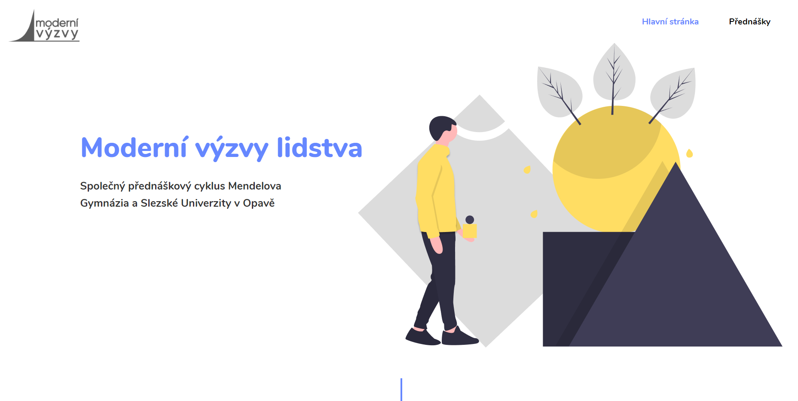
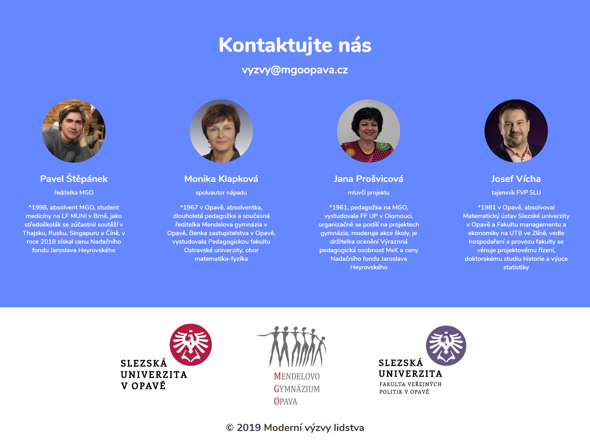

# [Moderní výzvy lidstva](https://pavlyuchenko.pythonanywhere.com/moderni_vyzvy_lidstva)
## [(Modern Challenges of Humanity)](https://pavlyuchenko.pythonanywhere.com/moderni_vyzvy_lidstva)

Website created for fun using mainly HTML with CSS and Javascript. I was trying to use parallax effect on pictures from unDraw.co, which turned out great as you can see on [Website Link](https://pavlyuchenko.pythonanywhere.com/moderni_vyzvy_lidstva). 
There is also a smooth scrolling effect, which unfortunately disrupts with the right sliding bar. The site is not actually used commercially.
  
*Here you can see the basic layout of the webpage*

